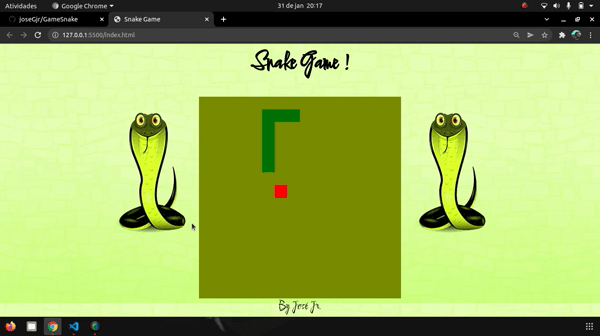

# Snake Game 🐍🎮


## Sobre o Projeto 📝
Este é um jogo clássico da cobrinha desenvolvido com HTML5, CSS3 e JavaScript. O objetivo do jogo é controlar a cobra e fazê-la crescer ao coletar comida sem colidir com as bordas ou com o próprio corpo.

## Tecnologias Utilizadas 🚀
- **HTML5**: Estrutura do jogo e canvas para renderização
- **CSS3**: Estilização da interface do jogo
- **JavaScript**: Lógica do jogo e manipulação do canvas

## Funcionalidades 📌
✔️ Movimentação da cobra usando as setas do teclado  
✔️ Aumento do tamanho ao coletar comida  
✔️ Verificação de colisões com bordas e corpo  
✔️ Exibição de pontuação  
✔️ Estilização personalizada com Google Fonts  

## Estrutura do Projeto 📂
```
📁 Snake-Game
│── 📄 index.html (Estrutura principal)
│── 📄 Mystyle.css (Estilos do jogo)
│── 📄 script.js (Lógica do jogo)
│── 📁 img (Imagens e ícones)
```

## Demonstração 🖥️
 

## Como Jogar 🎮
1. Clone o repositório:
   ```bash
   git clone https://github.com/seu-usuario/nome-do-repositorio.git
   ```
2. Abra o arquivo `index.html` no navegador.
3. Use as setas do teclado para movimentar a cobra.
4. O objetivo é coletar comida e crescer sem colidir!

## Contato 📩
Caso tenha sugestões ou queira contribuir, sinta-se à vontade para abrir uma issue ou enviar um pull request.

 
📧 **Email:** tubabajr@gmail.com

---
📝 Projeto criado para fins educacionais e demonstração de habilidades em desenvolvimento web.


